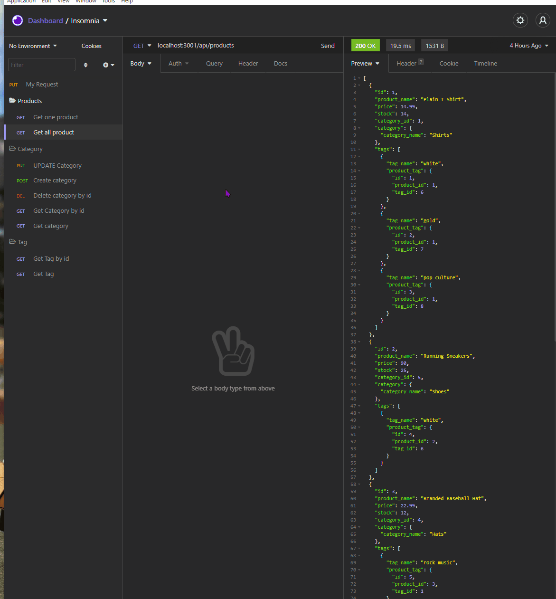
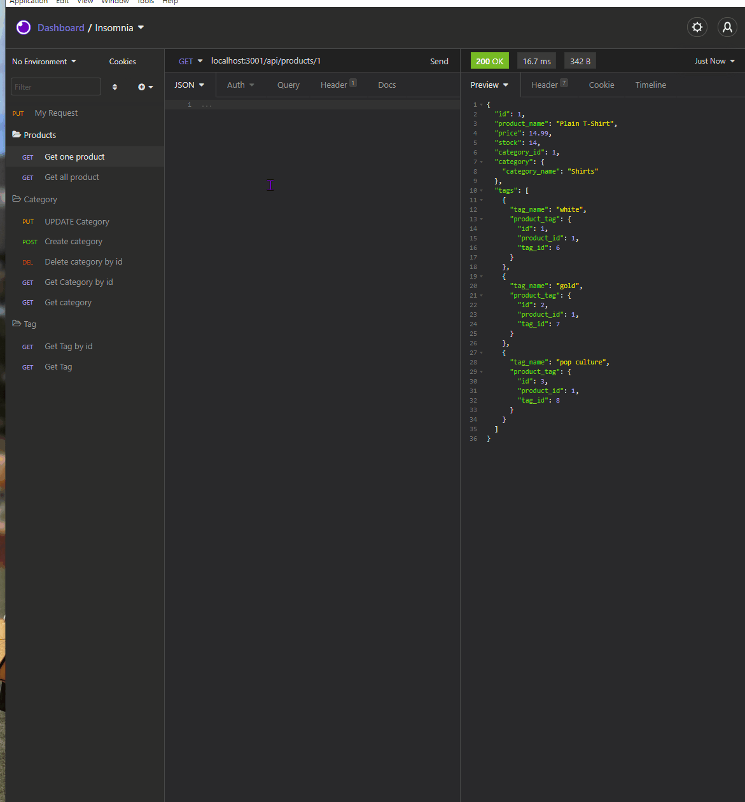
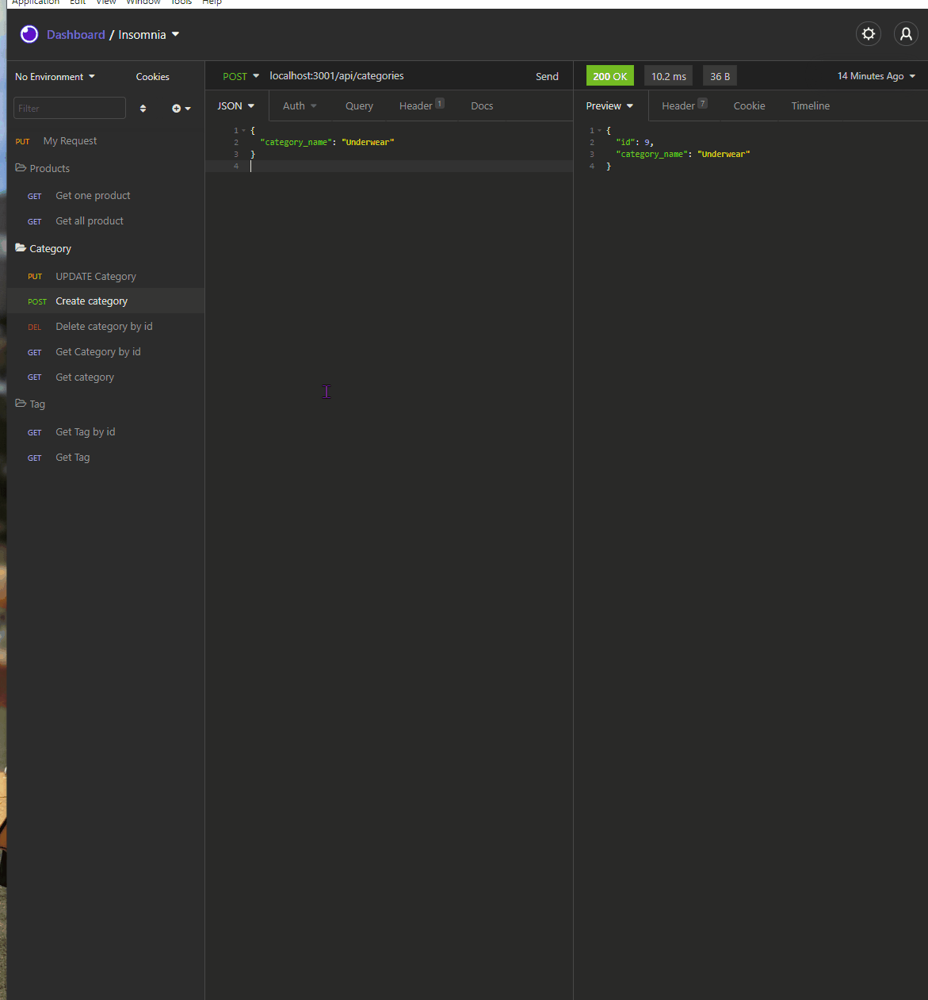

# Title
## E-commerce-back-end

## Table of contents
  - [Table of contents](#table-of-contents)
  - [Description](#description)
  - [Installation](#installation)
  - [Usage Information](#usage-information)
  - [License](#license)
  - [Video](#video)

## Description
The project design to create the  Object Releational Mapping (ORM) in the back end of ecommerce webapp. This project consists the express as backend framework which plays vital role for server listening, database connection collabrating with sequelize framework. In addtion, sequelize provides the tools to create model and execeuting queries, and  RESTful API serve the request and respond as per request made. The tables such as category, tag, product, and product_tag are used in the database for storing data.

## Installation
     need to be perfomed steps execution:
      1. node install   
      2. npm run seed    
      3. npm start
   
## Usage Information
     useful for storing the data regarding to product with category along with its tag. 

## License
     MIT license

## Video
### Get all Product, Categories and Tag

### Get One Product and Get Tag by ID

### Create, Update & Delete

